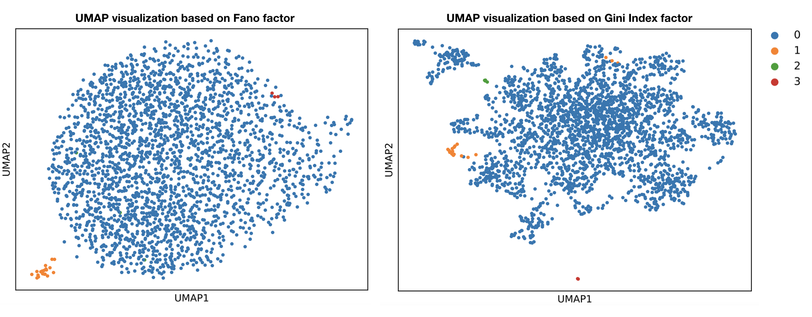

#Usage and example:

-----
##Workflow of pre-processing:

Import packages:

    import scanpy as sc
    import numpy as np
    import giniclust3 as gc
    import anndata

Import single cell count matrix from csv file:

    adataRaw=sc.read_csv("giniclust3/data/GSM1599495_ES_d0_biorep_techrep1.csv",first_column_names=True)

Filter gene expression matrix:

    sc.pp.filter_cells(adataRaw,min_genes=3)
    sc.pp.filter_genes(adataRaw,min_cells=200)

Transform expression matrix (skip this step if the input matrix is: col for genes and row for cells):

    adataSC=anndata.AnnData(X=adataRaw.X.T,obs=adataRaw.var,var=adataRaw.obs)

Gene expression normalization:

    sc.pp.normalize_per_cell(adataSC, counts_per_cell_after=1e4)

##Apply GiniClust3 for both common and rare cluster identification:

Perform GiniIndexClust:

    gc.gini.calGini(adataSC) ###Calculate Gini Index
    adataGini=gc.gini.clusterGini(adataSC,neighbors=3) ###Use higher value of neighbor in larger dataset. Recommend (5:15)

Perform FanoFactorClust:

    gc.fano.calFano(adataSC) ###Calculate Fano factor
    adataFano=gc.fano.clusterFano(adataSC) ###Cluster based on Fano factor

Generate conseneus matrix and apply ConsensusClust step:

    consensusCluster={}
    consensusCluster['giniCluster']=np.array(adataSC.obs['rare'].values.tolist())
    consensusCluster['fanoCluster']=np.array(adataSC.obs['fano'].values.tolist())
    gc.consensus.generateMtilde(consensusCluster) ###Generate consensus matrix
    gc.consensus.clusterMtilde(consensusCluster) ###Cluster consensus matrix
    ####output cluster results to final.txt####
    np.savetxt("final.txt",consensusCluster['finalCluster'], delimiter="\t",fmt='%s')

UMAP visualization:

    adataGini.obs['final']=consensusCluster['finalCluster']
    adataFano.obs['final']=consensusCluster['finalCluster']
    gc.plot.plotGini(adataGini)
    gc.plot.plotFano(adataFano)

UMAP visualization of the figures

